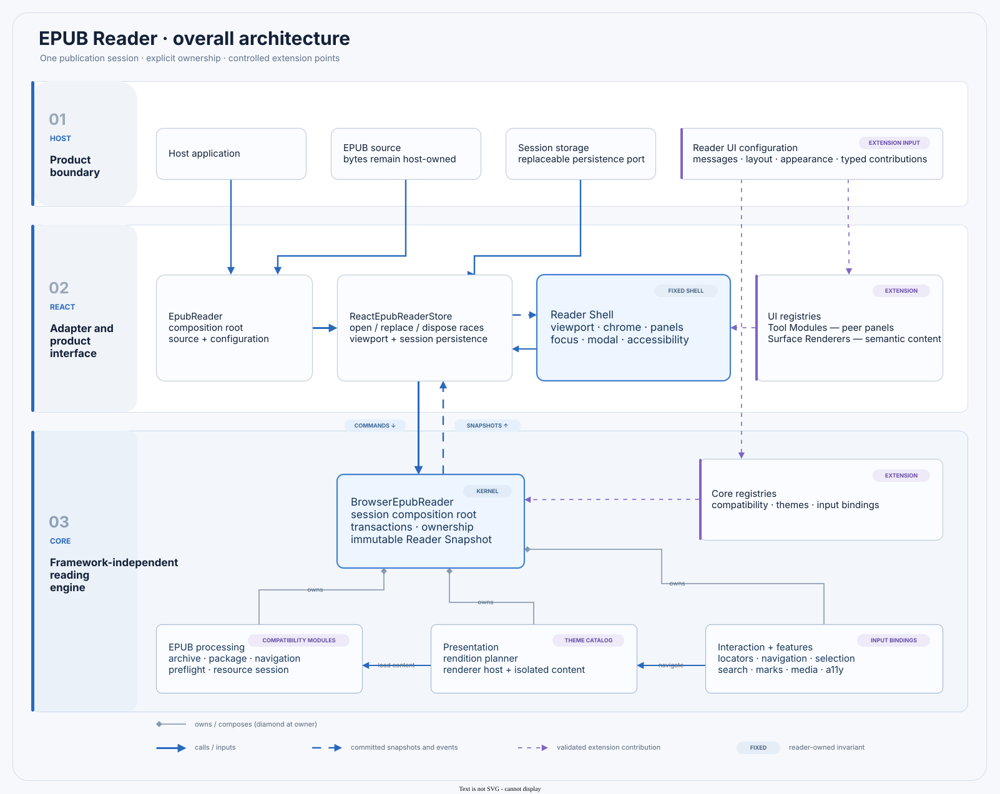

# 03 · Architecture

The host supplies EPUB bytes and product configuration. React adapts immutable state to the fixed Reader Shell. Core owns publication processing, rendering transactions, navigation, resource lifetime, and Reading Session consistency.



## Dependency direction

```text
host / showcase → react → core
```

Core never imports React or showcase code. Host and showcase code consume `react/index.ts`; React consumes `core/index.ts`. Leaf directories may expose focused barrels, while organizational group directories remain non-public to avoid cyclic aggregate imports.

`core/index.ts` exposes reader/domain contracts and the policy types needed to configure them. Archive implementations, XML helpers, resource materializers, renderer implementations, decoration internals, corpus/conformance utilities, and text-projection helpers remain internal deep modules rather than becoming accidental host API.

## Layer ownership

| Layer | Owns | Does not own |
| --- | --- | --- |
| Host | source acquisition, surrounding product, remote services | publication DOM and render transactions |
| React state adapter | source replacement races, viewport observation, optional browser persistence | EPUB parsing rules |
| Reader Shell | fixed layout, focus, dialogs, dismissal, responsive semantics, Chrome | publication processing and arbitrary plugin slots |
| React tools and surfaces | bounded peer panels and semantic surface content | Shell lifecycle or Core services |
| Core runtime | session composition, snapshots, command serialization, resource disposal | product-specific UI |
| EPUB processing | archive safety, package/navigation normalization, book compatibility, resource resolution | reader Chrome |
| Presentation and interaction | rendition plans, isolated renderers, locators, navigation and input routing | host workflows |

## Composition roots

`EpubReader` resolves `ReaderUiConfiguration`, creates the React adapter, selects registered Tool Modules and Surface Renderers, and mounts the fixed Shell. `ReactEpubReaderStore` protects asynchronous open/replace/dispose operations and republishes immutable Core snapshots.

`BrowserEpubReader` is the Core composition root for one opened publication. It wires archive/package loading, one immutable Compatibility Profile, preflight, resources, rendition planning, renderers, navigation, search, marks, selection, media routing, input, and diagnostics.

## Fixed and extensible boundaries

Archive/path safety, transaction ordering, resource ownership, renderer commits, Reader Snapshot consistency, Shell focus, modal accessibility, and external-link policy are fixed Kernel responsibilities.

Book compatibility modules, normalized input bindings, themes, React Tool Modules, and semantic Surface Renderers are implemented extension points. Publication-scoped Features, Capabilities, Providers, and Observers remain internal until their authority and lifecycle contracts are complete. See [Controlled extensions](./07-controlled-extensions.md) and the two ADRs for the rationale.

## Module map

- `core/epub/` — archive, package, navigation, content, compatibility, resources, text, and XML.
- `core/presentation/` — themes, rendition decisions, renderer contracts, and implementations.
- `core/interaction/` — input, locators, navigation, selection, and progress conversion.
- `core/features/` — search, marks, decorations, media, and accessibility descriptions.
- `core/runtime/` — reader/session composition and validated extension configuration.
- `react/state/` — external store, hook, public handle, and persistence adapter.
- `react/reader/` — composition root, viewport, context, and private Shell coordination.
- `react/tools/` and `react/surfaces/` — registered UI contribution contracts and providers.
- `react/chrome/`, `react/panels/`, `react/overlays/` — built-in product UI.
- `showcase/` — local demonstration only.
